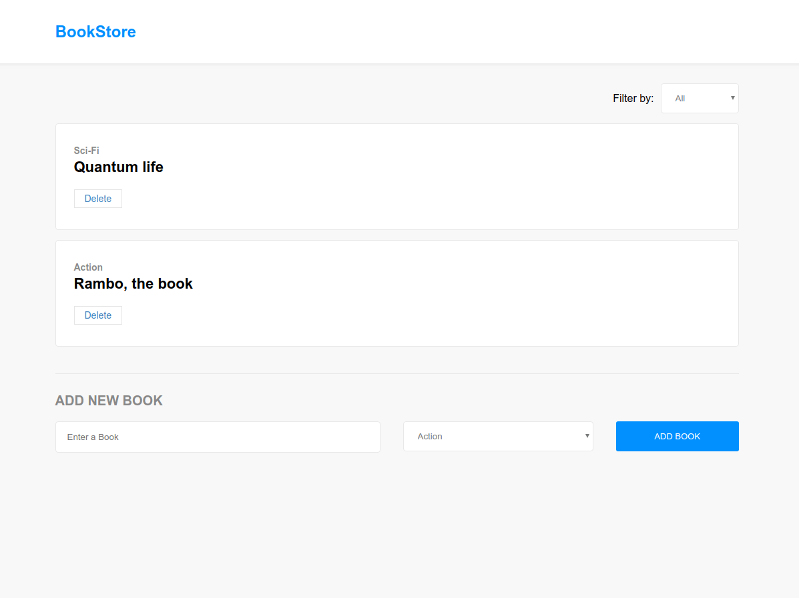

# React-Bookstore

This is a Bookstore CMS build in reactjs  and redux.



<!-- [Live demo here](https://SunnyAsar.github.io/react-Bookstore/) -->

## Getting Started

These instructions will get you a copy of the project up and running on your local machine for development and testing purposes.

### Prerequisites

* [Node.js](https://nodejs.org/en/download/)

### Installation

clone frontend repo

```bash
git clone https://github.com/SunnyAsar/react-Bookstore
```

clone backend repo

```bash
git clone https://github.com/HenryTabima/bookstore-backend
```

install dependencies in both projects

```bash
# For frontend
npm install

# For backend
bundle install
rails db:migrate
rails db:seed
```

> In the frontend project change "books-stub" import for "books" in `src/actions/index.js` to use the RoR backend service instead of a stub

### Start development servers

Start rails server (inside rails project folder)

```bash
rails s -p 4000
```

> Make sure that the development backend is running in port 4000

Start frontend server (inside react project folder)

```bash
npm start
```

open `localhost:3000` in your browser

## Deploy

```bash
npm run build
```

then you have to serve your static files

> When you run the build script your going to see instructions about how to deploy the project in github pages.

## Contributors

<!-- ALL-CONTRIBUTORS-LIST:START - Do not remove or modify this section -->
<!-- prettier-ignore-start -->
<!-- markdownlint-disable -->
<table>
  <tr>
    <td align="center"><a href="https://github.com/SunnyAsar"><br /><sub><b>SunnyAsar</b></sub></a><br /><a href="https://github.com/SunnyAsar/react-Bookstore/commits?author=SunnyAsar" title="Code">💻</a> <a href="https://github.com/SunnyAsar/react-Bookstore/commits?author=SunnyAsar" title="Documentation">📖</a></td>
    <td align="center"><a href="http://henrytabima.com"><br /><sub><b>Henry Tabima Giraldo</b></sub></a><br /><a href="https://github.com/SunnyAsar/react-Bookstore/commits?author=HenryTabima" title="Code">💻</a> <a href="https://github.com/SunnyAsar/react-Bookstore/commits?author=HenryTabima" title="Documentation">📖</a></td>
  </tr>
</table>

<!-- markdownlint-enable -->
<!-- prettier-ignore-end -->
<!-- ALL-CONTRIBUTORS-LIST:END -->

## License

This project is licensed under the MIT License - see the [LICENSE.md](LICENSE.md) file for details.
